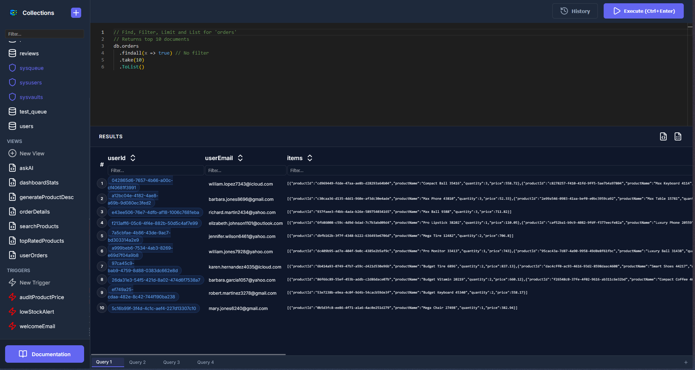

# 🔓 AxarDB - La Base de Datos NoSQL Nativa de JavaScript

> **AxarDB** es un servidor de base de datos NoSQL en memoria de alto rendimiento que le permite escribir consultas de base de datos directamente en **JavaScript**.

---

## 🌍 Idiomas

| [English](../README.md) | [Türkçe](README.tr.md) | [Русский](README.ru.md) | [中文](README.zh.md) | [Deutsch](README.de.md) | [日本語](README.ja.md) | [العربية](README.ar.md) | [Nederlands](README.nl.md) | [Български](README.bg.md) | [Italiano](README.it.md) | [Español](README.es.md) |
|---|---|---|---|---|---|---|---|---|---|---|

---

## 🚀 Características Clave

| Característica | Descripción |
|:---|:---|
| **📜 Consultas JavaScript** | Sintaxis JS completa. `db.users.findall(x => x.age > 18)` |
| **⚡ Alto Rendimiento** | Almacenamiento en memoria con `ConcurrentDictionary`. |
| **🛡️ Seguro** | Autenticación básica (soporta hash SHA256) y **prevención de inyecciones**. |
| **🛠️ Utilidades** | Funciones auxiliares integradas: `md5`, `sha256`, `encrypt`, `random`, `base64`. |

---

## 👨‍💻 Desarrollador

**Metin YAKAR**  
*Desarrollador de Software y Experto en .NET*  
Estambul, Turquía 🇹🇷

Experiencia **desde 2011**.

---

## 🤝 Soporte

### 💖 Apoya el Proyecto

| **Buy Me a Coffee** | **Ethereum** |
|:---:|:---:|
|  |  |

**[Reserva una sesión (Cal.com)](https://cal.com/metin-yakar-dfij9e)**

---

## 📄 Licencia
**Código Abierto (Restringido)** - Ver [LICENSE](../LICENSE).
