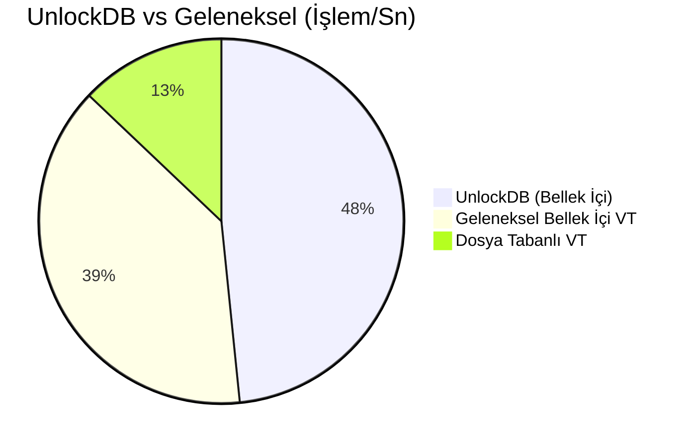

# 🔓 UnlockDB - JavaScript Tabanlı NoSQL Veritabanı


[](../LICENSE)
[](../Dockerfile)
[](https://dotnet.microsoft.com/)

> **UnlockDB**, veritabanı sorgularını doğrudan **JavaScript** ile yazmanıza olanak tanıyan, yüksek performanslı, bellek içi (in-memory) bir NoSQL veritabanı sunucusudur. ASP.NET Core 8.0 üzerinde inşa edilmiştir.

---

## 🌍 Diller

| [English](../README.md) | [Türkçe](README.tr.md) | [Русский](README.ru.md) | [中文](README.zh.md) | [Deutsch](README.de.md) | [日本語](README.ja.md) | [العربية](README.ar.md) | [Nederlands](README.nl.md) | [Български](README.bg.md) | [Italiano](README.it.md) | [Español](README.es.md) |
|---|---|---|---|---|---|---|---|---|---|---|

---


## 🚀 Temel Özellikler

| Özellik | Açıklama |
|:---|:---|
| **📜 JavaScript Sorguları** | Sorgularınızı tam JavaScript sözdizimi ile yazın. `db.users.findall(x => x.age > 18)` |
| **⚡ Yüksek Performans** | `ConcurrentDictionary` ve LINQ ile bellek içi depolama. |
| **🔍 Akıllı İndeksleme** | Herhangi bir alanda ASC/DESC indeks oluşturun. |
| **🔗 Join Desteği** | Koleksiyonlar arası birleştirme işlemleri: `db.join(users, orders)`. |
| **🛡️ Güvenli** | Basic Auth ve **Injection Koruması**. |
| **🐋 Docker Uyumlu** | Tek komutla çalıştırın: `docker run`. |
| **🛠️ Araçlar** | Dahili yardımcı fonksiyonlar: `md5`, `sha256`, `encrypt`, `random`, `base64`. |
| **🖥️ Yönetim Paneli** | Monaco Editör, Boyutlandırılabilir Grid ve Koyu Mod içeren Web Arayüzü. |

---

## 🏎️ Performans

UnlockDB, karmaşık protokoller yerine mantığınızı sunucu tarafında çalıştırır.



---

## 🐳 Docker ile Hızlı Başlangıç

Saniyeler içinde ayağa kaldırın:

```bash
docker run -d -p 5000:5000 -v $(pwd)/data:/app/data --name unlockdb unlockdb:latest
```

---

## 👨‍💻 Geliştirici

**Metin YAKAR**  
*Yazılım Geliştirici & .NET Uzmanı*  
İstanbul, Türkiye 🇹🇷

C# ve yazılım mimarisi üzerine **2011'den bu güne** tecrübesiyle Metin, yüksek performanslı sistemler ve yenilikçi geliştirici araçları inşa etmektedir.

[](https://www.linkedin.com/in/metin-yakar/)

---

## 🤝 Destek ve Katkı

UnlockDB'nin geleceğini inşa etmek için katkılarınızı bekliyoruz!
**İhtiyaç Duyulan Alanlar:**
- [ ] Gelişmiş Konfigürasyon Sistemi
- [ ] Gerçek Zamanlı Senkronizasyon (Real-time Sync)
- [ ] Küme İzleme Paneli (Monitoring)
- [ ] İstemci SDK'ları (Node.js, Python, Go)
- [ ] Veri Replikasyonu

### 💖 Projeyi Destekleyin

Bu projeyi sevdiyseniz, geliştirmeyi desteklemeyi düşünün!

| **Bir Kahve Ismarla** | **Ethereum** |
|:---:|:---:|
| <a href="https://buymeacoffee.com/metinyakar"></a> |  |

### 📅 Danışmanlık ve Eğitim

Yapay zeka destekli geliştirme ve Kod Otomasyonu konusunda danışmanlık mı gerekiyor?
**[Cal.com üzerinden randevu alın](https://cal.com/metin-yakar-dfij9e)**

---

## 📄 Lisans
**Açık Kaynak (Kısıtlı)** - UnlockDB'yi kullanabilir, inceleyebilir ve geliştirebilirsiniz. Ancak projeyi kopyalayıp rakip bir ticari ürün olarak sunamazsınız. Detaylar için [LICENSE](../LICENSE) dosyasına bakın.
