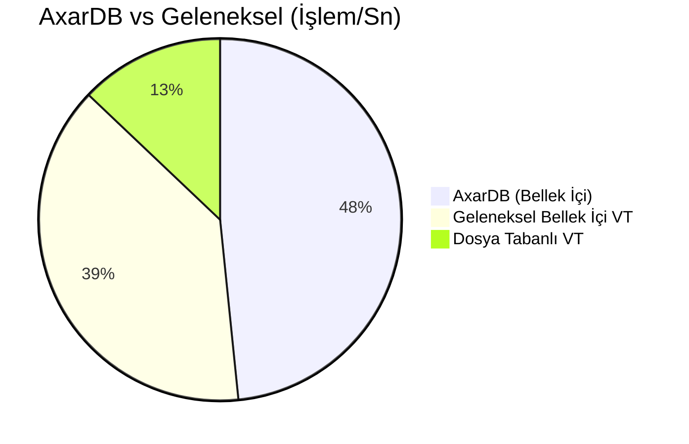

# 🔓 AxarDB - JavaScript Tabanlı NoSQL Veritabanı


[](../LICENSE)
[](../Dockerfile)
[](https://dotnet.microsoft.com/)

> **AxarDB**, veritabanı sorgularını doğrudan **JavaScript** ile yazmanıza olanak tanıyan, yüksek performanslı, bellek içi (in-memory) bir NoSQL veritabanı sunucusudur. ASP.NET Core 8.0 üzerinde inşa edilmiştir.

---

## 🌍 Diller

| [English](../README.md) | [Türkçe](README.tr.md) | [Русский](README.ru.md) | [中文](README.zh.md) | [Deutsch](README.de.md) | [日本語](README.ja.md) | [العربية](README.ar.md) | [Nederlands](README.nl.md) | [Български](README.bg.md) | [Italiano](README.it.md) | [Español](README.es.md) |
|---|---|---|---|---|---|---|---|---|---|---|

---


## 🚀 Temel Özellikler

| Özellik | Açıklama |
|:---|:---|
| **📜 JavaScript Sorguları** | Sorgularınızı tam JavaScript sözdizimi ile yazın. `db.users.findall(x => x.age > 18)` |
| **⚡ Yüksek Performans** | `ConcurrentDictionary` ve LINQ ile bellek içi depolama. |
| **🔍 Akıllı İndeksleme** | Herhangi bir alanda ASC/DESC indeks oluşturun. |
| **🔗 Join Desteği** | Koleksiyonlar arası birleştirme işlemleri: `db.join(users, orders)`. |
| **🛡️ Güvenli** | Basic Auth (SHA256 hash desteği ile) ve **Injection Koruması**. |
| **🐋 Docker Uyumlu** | Tek komutla çalıştırın: `docker run`. |
| **🛠️ Araçlar** | Dahili yardımcı fonksiyonlar: `md5`, `sha256`, `encrypt`, `random`, `base64`. |
| **🖥️ Yönetim Paneli** | Monaco Editör, Boyutlandırılabilir Grid ve Koyu Mod içeren Web Arayüzü. |

---

## 🏎️ Performans

AxarDB, karmaşık protokoller yerine mantığınızı sunucu tarafında çalıştırır.



---

## 🐳 Docker ile Hızlı Başlangıç

Saniyeler içinde ayağa kaldırın:

```bash
docker run -d -p 5000:5000 -v $(pwd)/data:/app/data --name AxarDB AxarDB:latest
```

```

---

## 🛠️ CLI Aracı

AxarDB, veritabanınızı komut satırından yönetmek için güçlü bir CLI aracı (`AxarDB.Cli`) ile birlikte gelir.

### Temel Kullanım

```bash
dotnet run --project SDKs/cli/AxarDB.Cli -- --host http://localhost:5000 --user admin --pass admin
```

### Komutlar

| Komut | Açıklama | Örnek |
| :--- | :--- | :--- |
| `--show-collections` | Tüm koleksiyonları listeler. | `--show-collections` |
| `--insert <col> <json>` | Bir koleksiyona JSON belgesi ekler. | `--insert users "{\"name\":\"Alice\"}"` |
| `--select <col> <sel>` | Bir seçici ifade kullanarak veri projeksiyonu yapar. | `--select users "x => x.name"` |
| `--script <js>` | Ham JavaScript sorgusu çalıştırır. | `--script "db.users.count()"` |
| `--file <path>` | Bir JavaScript dosyasını çalıştırır. | `--file ./query.js` |

---

## � Dahili Fonksiyonlar

AxarDB, script ve view içerisinde kullanabileceğiniz güçlü yardımcı fonksiyonlar sunar.

### 📅 Tarih İşlemleri
Tarih manipülasyonu için .NET benzeri metodlar mevcuttur ve `DateTime` nesnesi döndürürler.

```javascript
var now = new Date();

// 5 dakika ekle
var future = addMinutes(now, 5);

// 2 gün ekle
var nextWeek = addDays(now, 2);

// 3 saat ekle
var later = addHours(now, 3);
```

### 🌐 HTTP İstekleri
Dış servislerle iletişim kurmak için `httpGet` ve `webhook` (POST) kullanılabilir.

**httpGet(url, headers?)**
```javascript
// Basit GET isteği
var response = httpGet("https://api.example.com/data");
if (response.success) {
    console.log(response.data);
}

// Header ile GET isteği
var responseWithHeader = httpGet("https://api.example.com/secure", { "Authorization": "Bearer token" });
```

**webhook(url, data, headers?)**
```javascript
// POST isteği
webhook("https://api.example.com/notify", { message: "Hello" });
```

---


## �📦 İstemci SDK'ları

C# ve Python için tam tip destekli (strongly typed) ve asenkron (async) çalışan resmi SDK'lar mevcuttur.

### C# SDK Özellikleri
- `InsertAsync<T>`: Asenkron olarak nesne ekleme.
- `ShowCollectionsAsync`: Tüm koleksiyonları listeleme.
- `SelectAsync<TResult>`: Asenkron veri projeksiyonu ve çekme.
- `RandomStringAsync(int len)`: Sunucu tarafı fonksiyonu ile rastgele dize oluşturucu.

### Python SDK Özellikleri
- `insert_async`: Thread-safe asenkron ekleme.
- `show_collections_async`: Asenkron koleksiyon listeleme.
- `select_async`: Asenkron projeksiyon.
- `random_string_async(len)`: Asenkron rastgele dize oluşturucu.

### SDK ve Model Kullanımı
Veri tutarlılığını sağlamak ve benzersiz ID'leri garanti etmek için veri modelleriniz `AxarBaseModel` sınıfından miras almalıdır.

**C# Örneği:**
```csharp
public class MyUser : AxarBaseModel
{
    public string Name { get; set; }
}
// ID otomatik olarak oluşturulur
await client.InsertAsync("users", new MyUser { Name = "Alice" });
```

**Python Örneği:**
```python
from axardb import AxarBaseModel

class MyUser(AxarBaseModel):
    def __init__(self, name):
        super().__init__()
        self.name = name

# ID otomatik olarak oluşturulur
await client.insert_async("users", MyUser("Alice"))
```

---

## 👨‍💻 Geliştirici

**Metin YAKAR**  
*Yazılım Geliştirici & .NET Uzmanı*  
İstanbul, Türkiye 🇹🇷

C# ve yazılım mimarisi üzerine **2011'den bu güne** tecrübesiyle Metin, yüksek performanslı sistemler ve yenilikçi geliştirici araçları inşa etmektedir.

[](https://www.linkedin.com/in/metin-yakar/)


### Parametreli View Çağrımı

**C# Örneği:**
```csharp
// View oluşturulur
await client.CreateViewAsync("myview", "db.users.findall(x => x.age > @minAge).toList()");

// View parametre ile çağrılır
var users = await client.CallViewAsync<User[]>("myview", new { minAge = 18 });
```

**Python Örneği:**
```python
# View oluşturulur
client.create_view("myview", "db.users.findall(x => x.age > @minAge).toList()")

# View parametre ile çağrılır
users = client.call_view("myview", { "minAge": 18 })
```

---

## 🤝 Destek ve Katkı

AxarDB'nin geleceğini inşa etmek için katkılarınızı bekliyoruz!
**İhtiyaç Duyulan Alanlar:**
- [ ] Gelişmiş Konfigürasyon Sistemi
- [ ] Gerçek Zamanlı Senkronizasyon (Real-time Sync)
- [ ] Küme İzleme Paneli (Monitoring)
- [ ] İstemci SDK'ları (Node.js, Python, Go)
- [ ] Veri Replikasyonu

### 💖 Projeyi Destekleyin

Bu projeyi sevdiyseniz, geliştirmeyi desteklemeyi düşünün!

| **Bir Kahve Ismarla** | **Ethereum** |
|:---:|:---:|
| <a href="https://buymeacoffee.com/metinyakar"></a> |  |

### 📅 Danışmanlık ve Eğitim

Yapay zeka destekli geliştirme ve Kod Otomasyonu konusunda danışmanlık mı gerekiyor?
**[Cal.com üzerinden randevu alın](https://cal.com/metin-yakar-dfij9e)**

---

## 📄 Lisans
**Açık Kaynak (Kısıtlı)** - AxarDB'yi kullanabilir, inceleyebilir ve geliştirebilirsiniz. Ancak projeyi kopyalayıp rakip bir ticari ürün olarak sunamazsınız. Detaylar için [LICENSE](../LICENSE) dosyasına bakın.
