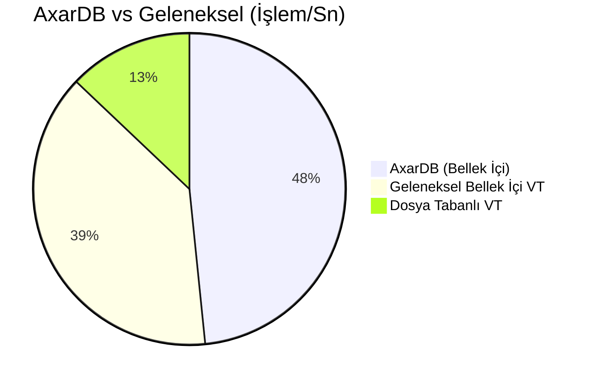

# 🔓 AxarDB - JavaScript Tabanlı NoSQL Veritabanı


[](../LICENSE)
[](../Dockerfile)
[](https://dotnet.microsoft.com/)

> **AxarDB**, veritabanı sorgularını doğrudan **JavaScript** ile yazmanıza olanak tanıyan, yüksek performanslı, bellek içi (in-memory) bir NoSQL veritabanı sunucusudur. ASP.NET Core 8.0 üzerinde inşa edilmiştir.

---

## 🌍 Diller

| [English](../README.md) | [Türkçe](README.tr.md) | [Русский](README.ru.md) | [中文](README.zh.md) | [Deutsch](README.de.md) | [日本語](README.ja.md) | [العربية](README.ar.md) | [Nederlands](README.nl.md) | [Български](README.bg.md) | [Italiano](README.it.md) | [Español](README.es.md) |
|---|---|---|---|---|---|---|---|---|---|---|

---


## 🚀 Temel Özellikler

| Özellik | Açıklama |
|:---|:---|
| **📜 JavaScript Sorguları** | Tam JavaScript sözdizimi kullanın: `db.users.findall(x => x.active).toList()`. ResultSet ve Native dizi üzerinde yepyeni `count()` ve `distinct()` uzantılarını destekler. |
| **⚡ Yüksek Performans** | `ConcurrentDictionary`, PLINQ ile Tembel Değerlendirme (Lazy Eval) ve katı %40 RAM kapasite limitli Dinamik Önbellek Yönetimi. |
| **🧠 Bellek İçi Depo (Memory Store)** | `memory.sessions.insert({...})` ile TTL destekli geçici depolama. Oturum, önbellek ve kısa ömürlü veriler için idealdir. |
| **📄 CSV Motoru** | İki yönlü, güçlü CSV desteği. `csv(girdi)` fonksiyonu ile metinleri anında nesnelere, nesne listelerini ise CSV dosyalarına çevirin. |
| **🔍 Akıllı İndeksleme** | Herhangi bir alanda ASC/DESC indeks oluşturun. |
| **🔗 Join Desteği** | Koleksiyonlar arası güçlü join ve alias (takma ad) desteği. |
| **📄 Sayfalama (Pagination)** | `skip(n).take(n)` zinciriyle kolayca sayfalama yapın. |
| **🛡️ Güvenli** | Basic Auth (SHA256 hash desteği ile), **Injection Koruması** ve `sys` ön ekli özel koleksiyon adlarını engelleyen **Sistem Koleksiyon Koruması**. |
| **🔐 Kasa (Vaults)** | `$KEY` sözdizimi ile API anahtarları için güvenli anahtar-değer depolama. `db.sysvaults` koleksiyonuna doğrudan ekleme kısıtlanmıştır; `addVault()` kullanılmalıdır. |
| **⏳ Görev Kuyruğu** | `queue("script", params, { priority: 1 })` ile arka plan görevi çalıştırma. `completedAt` zaman damgasıyla tamamlanma takibi sağlar. `db.sysqueue` koleksiyonuna doğrudan ekleme kısıtlanmıştır. |
| **🖥️ Yönetim Paneli** | Monaco Editör, Sekme Sistemi (Tab), Sorgu Geçmişi, `@param` algılamalı Akıllı View Tıklama, Boyutlandırılabilir Grid ve Koyu Mod içeren Web Arayüzü. |

---

## 🏎️ Performans

AxarDB, karmaşık protokoller yerine mantığınızı sunucu tarafında çalıştırır.


```mermaid
pie title AxarDB vs Geleneksel (İşlem/Sn)
    "AxarDB (Bellek İçi)" : 15000
    "Geleneksel Bellek İçi VT" : 12000
    "Dosya Tabanlı VT" : 4000
```

---

## 🐳 Docker ile Hızlı Başlangıç

Saniyeler içinde ayağa kaldırın:

```bash
docker run -d -p 5000:5000 -v $(pwd)/data:/app/data --name AxarDB AxarDB:latest
```

### Özel Port ve CORS Tanımı
```bash
# Sadece belirli bir domain'e izin vermek için
dotnet run -- -p 5001 --cors "http://localhost:3000"
```

---

## ⚙️ Yapılandırma (Configuration)

AxarDB yapılandırma ayarları, veritabanı içindeki `sysconfig` isimli özel bir sistem koleksiyonunda saklanır. İlk kurulum esnasında bu koleksiyon otomatik olarak varsayılan ayarlar ile doldurulur.

Ayarları değiştirmek için yetkili bir kullanıcı `sysconfig` koleksiyonundaki belgeyi güncelleyebilir. Yeni ayarlar veritabanı sunucusu yeniden başlatıldığında aktif olacaktır. `sysconfig` koleksiyonuna doğrudan ekleme (insert) işlemi yapılmasına izin verilmez.

### Sistem Koleksiyon Koruması

`sys` ile başlayan tüm koleksiyon adları **rezerve edilmiştir** ve iç altyapı için kullanılır. Yalnızca dört ön tanımlı sistem koleksiyonuna izin verilir: `sysusers`, `sysqueue`, `sysvaults` ve `sysconfig`. Herhangi bir özel `sys` ön ekli koleksiyon oluşturma veya erişme girişimi (örn. `db.sysnew`) `InvalidOperationException` hatası fırlatır. Bu koruma Bridge, Engine ve Collection katmanlarında uygulanır.

### Kullanılabilir Parametreler

| Özellik | Tip | Varsayılan Değer | Açıklama |
| :--- | :--- | :--- | :--- |
| `memoryLimitPercentage` | `double` | `0.4` | Veritabanının maksimum bellek kullanım oranını belirler (örn: %30 için `0.3`). |
| `bulkStoreMaxCacheBytes` | `long` | `52428800` (50MB) | Toplu önbellek boyutu limitidir (byte). |
| `maxRecursionDepth` | `int` | `100` | Çalıştırılan script'lerin maksimum yineleme (recursion) derinliğini sınırlar. |
| `queryTimeoutMinutes` | `int` | `10` | Sorgu çalışma süresi sınırıdır (dakika). |
| `queuePollIntervalSeconds` | `double` | `1.0` | Arka plan kuyruğunun kontrol edilme sıklığıdır (saniye). |

### Yapılandırma Örneği
Sorgu konsolu üzerinden ayarları değiştirmek için (etkin olması için sunucu yeniden başlatılmalıdır):
```javascript
db.sysconfig.update(x => true, { queryTimeoutMinutes: 15 });
```

---

## 🛠️ CLI Aracı

AxarDB, veritabanınızı komut satırından yönetmek için güçlü bir CLI aracı (`AxarDB.Cli`) ile birlikte gelir.

### Temel Kullanım

```bash
dotnet run --project SDKs/cli/AxarDB.Cli -- --host http://localhost:5000 --user admin --pass admin
```

### Komutlar

| Komut | Açıklama | Örnek |
| :--- | :--- | :--- |
| `--show-collections` | Tüm koleksiyonları listeler. | `--show-collections` |
| `--insert <col> <json>` | Bir koleksiyona JSON belgesi ekler. | `--insert users "{\"name\":\"Alice\"}"` |
| `--select <col> <sel>` | Bir seçici ifade kullanarak veri projeksiyonu yapar. | `--select users "x => x.name"` |
| `--script <js>` | Ham JavaScript sorgusu çalıştırır. | `--script "db.users.count()"` |
| `--file <path>` | Bir JavaScript dosyasını çalıştırır. | `--file ./query.js` |

---

## ⚙️ Dahili Fonksiyonlar

AxarDB, script ve view içerisinde kullanabileceğiniz güçlü yardımcı fonksiyonlar sunar.

### 📅 Tarih İşlemleri
Tarih manipülasyonu için .NET benzeri metodlar mevcuttur ve `DateTime` nesnesi döndürürler.

```javascript
var now = new Date();

// 5 dakika ekle
var future = addMinutes(now, 5);

// 2 gün ekle
var nextWeek = addDays(now, 2);

// 3 saat ekle
var later = addHours(now, 3);
```

### 🌐 HTTP İstekleri
Dış servislerle iletişim kurmak için `httpGet` ve `webhook` (POST) kullanılabilir.

**httpGet(url, headers?)**
```javascript
// Basit GET isteği
var response = httpGet("https://api.example.com/data");
if (response.success) {
    console.log(response.data);
}

// Header ile GET isteği
var responseWithHeader = httpGet("https://api.example.com/secure", { "Authorization": "Bearer token" });
```

**webhook(url, data, headers?)**
```javascript
// POST isteği
webhook("https://api.example.com/notify", { message: "Hello" });
```

---

## 🧠 Memory Store (Geçici Bellek Deposu)

`memory` nesnesi, `db` ile tamamen aynı şekilde kullanılır; ancak veriler **yalnızca sunucu belleğinde** tutulur ve diske yazılmaz. Her kayıt için yaşam süresi (TTL) belirlenebilir.

> `memory` nesnesi `db` gibi doğrudan (top-level) kullanılır.

```javascript
// Varsayılan TTL ile ekle (1 saat)
memory.sessions.insert({ userId: "abc123", token: "xyz" });

// Özel TTL ile ekle (2.5 saat)
memory.sessions.insert({ userId: "def456", token: "abc" }, 2.5);

// Tüm kayıtları getir
var sessions = memory.sessions.findall().toList();

// Filtreleyerek getir
var session = memory.sessions.find(s => s.userId == "abc123");

// Sil
memory.sessions.findall(s => s.token == "xyz").delete();
```

| Özellik | `db` | `memory` |
|:---|:---|:---|
| Kalıcılık | ✅ Disk | ❌ Yalnızca RAM |
| TTL Desteği | ❌ Yok | ✅ Otomatik silme (varsayılan 1 saat) |
| Kullanım | Kalıcı veriler | Oturum, önbellek, geçici veriler |

---

## 📄 Sayfalama (skip & take)

`skip(n)` ve `take(n)` zinciriyle kolayca sayfalama yapın:

```javascript
// 1. sayfa (1-10 arası kayıtlar)
var page1 = db.users.findall().take(10).toList();

// 2. sayfa (11-20 arası kayıtlar)
var page2 = db.users.findall().skip(10).take(10).toList();

// 3. sayfa (21-30 arası kayıtlar)
var page3 = db.users.findall().skip(20).take(10).toList();
```

---

## 📦 Bulk Store (JSONL Toplu Veri Deposu)

`bulk` nesnesi, `Bulk/` klasörü içinde JSONL (JSON Lines) formatında tutulan verileri yönetir. Ülke listeleri, posta kodları gibi büyük ama sabit veri setlerinde diski yormadan yüksek hızlı sorgulama yapılması için tasarlanmıştır.

**Temel Özellikler:**
- **LRU Bellek Önbelleği:** Kayıtları `bulkStoreMaxCacheBytes` limitine kadar önbellekte tutar (varsayılan: 50 MB), en az kullanılan koleksiyonları otomatik temizler.
- **Bellek Sınırlı Parçalı Sorgulama:** Büyük dosyalarda filtreleme sorguları satır satır işlenir. Her parça için yalnızca predicate'te referans verilen alanlardan geçici hafif indeks oluşturulur, bellek kullanımı `bulkStoreMaxCacheBytes` ile sınırlı tutulur.
- **Otomatik Yenileme:** FileSystemWatcher disk değişikliklerini algılar ve önbelleği otomatik yeniler.

> `bulk` nesnesi `db` ve `memory` gibi doğrudan (top-level) kullanılır.

```javascript
// Toplu veri yükleme (Array formatında nesne listesi alır)
bulk.countries.insert([
  { name: "Türkiye", code: "TR", population: 85000000 },
  { name: "Almanya", code: "DE", population: 83000000 }
]);

// Tüm verileri çek
var list = bulk.countries.findall().toList();

// Belirli bir kaydı bul
var tr = bulk.countries.find(c => c.code == "TR");

// Önbelleği manuel yenile
bulk.reload("countries");
```

---

## 📊 İzleme Arayüzü (Monitoring)

AxarDB, veritabanının anlık durumunu izleyebilmeniz için dahili bir izleme paneli sunar.

- **Erişim**: `/monitor` veya doğrudan `/monitoring.html` adresinden erişilebilir.
- **Özellikler**:
  - İstek/sn ve anlık hata oranları.
  - Grafiksel bellek (RAM) ve disk kullanımı takibi.
  - View, Trigger ve Kuyruk (Queue) işlemlerinin ortalama ve maksimum çalışma maliyetleri.
  - Son 50 HTTP isteğinin detaylı dökümü.

---


## 📦 İstemci SDK'ları

C# ve Python için tam tip destekli (strongly typed) ve asenkron (async) çalışan resmi SDK'lar mevcuttur.

### C# SDK Özellikleri
- `InsertAsync<T>`: Asenkron olarak nesne ekleme.
- `ShowCollectionsAsync`: Tüm koleksiyonları listeleme.
- `SelectAsync<TResult>`: Asenkron veri projeksiyonu ve çekme.
- `RandomStringAsync(int len)`: Sunucu tarafı fonksiyonu ile rastgele dize oluşturucu.

### Python SDK Özellikleri
- `insert_async`: Thread-safe asenkron ekleme.
- `show_collections_async`: Asenkron koleksiyon listeleme.
- `select_async`: Asenkron projeksiyon.
- `random_string_async(len)`: Asenkron rastgele dize oluşturucu.

### SDK ve Model Kullanımı
Veri tutarlılığını sağlamak ve benzersiz ID'leri garanti etmek için veri modelleriniz `AxarBaseModel` sınıfından miras almalıdır.

**C# Örneği:**
```csharp
public class MyUser : AxarBaseModel
{
    public string Name { get; set; }
}
// ID otomatik olarak oluşturulur
await client.InsertAsync("users", new MyUser { Name = "Alice" });
```

**Python Örneği:**
```python
from axardb import AxarBaseModel

class MyUser(AxarBaseModel):
    def __init__(self, name):
        super().__init__()
        self.name = name

# ID otomatik olarak oluşturulur
await client.insert_async("users", MyUser("Alice"))
```

---

## 👨‍💻 Geliştirici

**Metin YAKAR**  
*Yazılım Geliştirici & .NET Uzmanı*  
İstanbul, Türkiye 🇹🇷

C# ve yazılım mimarisi üzerine **2011'den bu güne** tecrübesiyle Metin, yüksek performanslı sistemler ve yenilikçi geliştirici araçları inşa etmektedir.

[](https://www.linkedin.com/in/metin-yakar/)


### Parametreli View Çağrımı

**C# Örneği:**
```csharp
// View oluşturulur
await client.CreateViewAsync("myview", "db.users.findall(x => x.age > @minAge).toList()");

// View parametre ile çağrılır
var users = await client.CallViewAsync<User[]>("myview", new { minAge = 18 });
```

**Python Örneği:**
```python
# View oluşturulur
client.create_view("myview", "db.users.findall(x => x.age > @minAge).toList()")

# View parametre ile çağrılır
users = client.call_view("myview", { "minAge": 18 })
```

---

## 🤝 Destek ve Katkı

AxarDB'nin geleceğini inşa etmek için katkılarınızı bekliyoruz!
**İhtiyaç Duyulan Alanlar:**
- [ ] Gerçek Zamanlı Senkronizasyon (Real-time Sync)
- [ ] Küme İzleme Paneli (Monitoring)
- [ ] İstemci SDK'ları (Node.js, Python, Go)
- [ ] Veri Replikasyonu

### 💖 Projeyi Destekleyin

Bu projeyi sevdiyseniz, geliştirmeyi desteklemeyi düşünün!

| **Bir Kahve Ismarla** | **Ethereum** |
|:---:|:---:|
| <a href="https://buymeacoffee.com/metinyakar"></a> |  |

### 📅 Danışmanlık ve Eğitim

Yapay zeka destekli geliştirme ve Kod Otomasyonu konusunda danışmanlık mı gerekiyor?
**[Cal.com üzerinden randevu alın](https://cal.com/metin-yakar-dfij9e)**

---

## 📄 Lisans
**Açık Kaynak (Kısıtlı)** - AxarDB'yi kullanabilir, inceleyebilir ve geliştirebilirsiniz. Ancak projeyi kopyalayıp rakip bir ticari ürün olarak sunamazsınız. Detaylar için [LICENSE](../LICENSE) dosyasına bakın.
