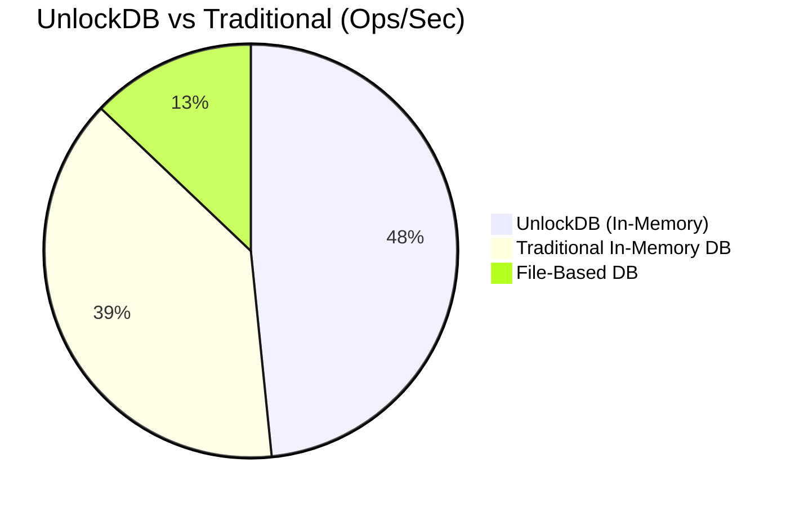

# 🔓 UnlockDB - The JavaScript-Native NoSQL Database


[](LICENSE)
[](Dockerfile)
[](https://dotnet.microsoft.com/)
[](https://github.com/sebastienros/jint)

> **UnlockDB** is a high-performance, in-memory NoSQL database server that allows you to write database queries directly in **JavaScript**. Built on ASP.NET Core 8.0, it combines the flexibility of a document store with the power of a full JavaScript runtime.

<br>

</br>

---

## 🌍 Languages

| [English](README.md) | [Türkçe](Docs/README.tr.md) | [Русский](Docs/README.ru.md) | [中文](Docs/README.zh.md) | [Deutsch](Docs/README.de.md) | [日本語](Docs/README.ja.md) | [العربية](Docs/README.ar.md) | [Nederlands](Docs/README.nl.md) | [Български](Docs/README.bg.md) | [Italiano](Docs/README.it.md) | [Español](Docs/README.es.md) |
|---|---|---|---|---|---|---|---|---|---|---|

---

## 🚀 Key Features

| Feature | Description |
|:---|:---|
| **📜 JavaScript Querying** | Use full JavaScript syntax for queries. `db.users.findall(x => x.age > 18)` |
| **⚡ High Performance** | In-memory storage with `ConcurrentDictionary` and lazy evaluation using LINQ. |
| **🔍 Smart Indexing** | Create ASC/DESC indexes on any field. Supports optimized range queries. |
| **🔗 Joins** | Perform complex joins between collections directly in the query: `db.join(users, orders)`. |
| **🛡️ Secure** | Basic Authentication & **Injection Prevention** via parameter binding. |
| **🐋 Docker Ready** | Runs anywhere with a single `docker run` command. |
| **🖥️ Management Console** | Beautiful Web UI with Monaco Editor, Resizable Datagrid, and Dark Mode. |

---

## 🏎️ Performance Benchmarks

Unlike traditional databases that require complex protocols, UnlockDB executes your logic on the server.


*Benchmark run on standard workstation. Actual performance depends on hardware.*

---

## 🐳 Quick Start with Docker

Get up and running in seconds:

```bash
docker run -d -p 5000:5000 -v $(pwd)/data:/app/data --name unlockdb unlockdb:latest
```

Or using `docker-compose`:
```yaml
services:
  unlockdb:
    build: .
    ports: ["5000:5000"]
    volumes: ["./data:/app/data"]
```

---

## 👨‍💻 Developer

**Metin YAKAR**  
*Software Developer & .NET Expert*  
Istanbul, Turkey 🇹🇷

Experience **since 2011** in C# and software architecture. Metin specializes in building high-performance systems and innovative developer tools.

[](https://www.linkedin.com/in/metin-yakar/)

---

## 🤝 Support & Contribution

We are looking for contributors to help build the future of UnlockDB!
**Areas we need help with:**
- [ ] Advanced Configuration System
- [ ] Real-time Synchronization
- [ ] Cluster Monitoring Dashboard
- [ ] Client SDKs (Node.js, Python, Go)
- [ ] Data Replication & Sharding

### 💖 Support the Project

If you love this project, consider supporting its development!

| **Buy Me a Coffee** | **Ethereum** |
|:---:|:---:|
| <a href="https://buymeacoffee.com/metinyakar"></a> |  |

### 📅 Consulting & Training

Need help integrating UnlockDB or want advice on AI-driven development and Code Automation?
**[Book a session on Cal.com](https://cal.com/metin-yakar-dfij9e)**

---

## 📄 License
**Open Source (Restricted)** - You can use, modify, and learn from UnlockDB. However, you are **not allowed** to clone the repository to release a competing standalone database product. See [LICENSE](LICENSE) for details.
