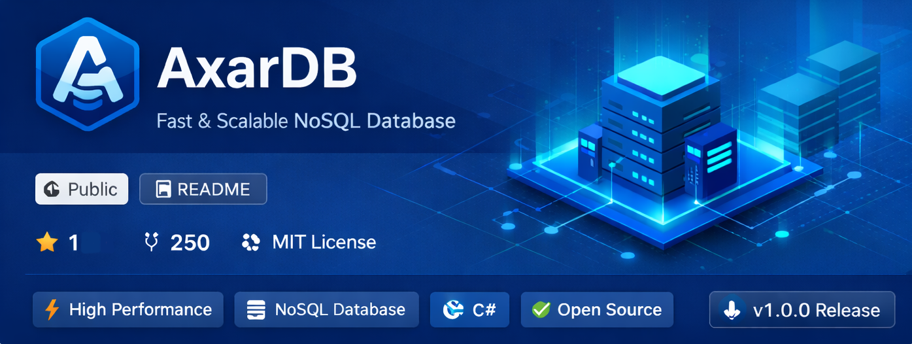
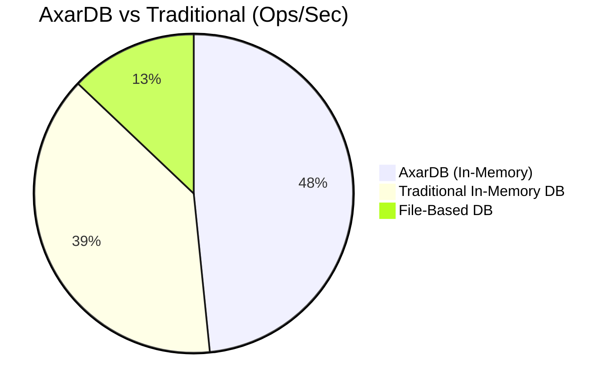

[](LICENSE)
[](Dockerfile)
[](https://dotnet.microsoft.com/)
[](https://github.com/sebastienros/jint)

> **AxarDB** is a high-performance, in-memory NoSQL database server that allows you to write database queries directly in **JavaScript**. Built on ASP.NET Core 8.0, it combines the flexibility of a document store with the power of a full JavaScript runtime.

---

## 🌍 Languages

| [English](README.md) | [Türkçe](Docs/README.tr.md) | [Русский](Docs/README.ru.md) | [中文](Docs/README.zh.md) | [Deutsch](Docs/README.de.md) | [日本語](Docs/README.ja.md) | [العربية](Docs/README.ar.md) | [Nederlands](Docs/README.nl.md) | [Български](Docs/README.bg.md) | [Italiano](Docs/README.it.md) | [Español](Docs/README.es.md) |
|---|---|---|---|---|---|---|---|---|---|---|

---


## 🚀 Key Features

| Feature | Description |
|:---|:---|
| **📜 JavaScript Querying** | Use full JS structure: `db.users.findall(x => x.active).toList()`. Supports new extensions like `count()` and `distinct()` on both ResultSets and Native Arrays. |
| **⚡ High Performance** | In-memory storage with `ConcurrentDictionary`, lazy evaluation using PLINQ, and strictly-capped dynamic 40% Memory Cache expiration. |
| **🧠 Memory Store** | `memory.sessions.insert({...})` with TTL support for sessions, caches, and short-lived data. |
| **💾 Bulk Store** | High-performance JSONL static storage with LRU caching and memory-bounded chunked queries for large files. |
| **📄 CSV Engine** | Bidirectional robust CSV support. Convert text to Collections or Collections to CSV via `csv(input)`. |
| **🔍 Smart Indexing** | Create ASC/DESC indexes on any field. Supports optimized range queries. |
| **🔗 Joins** | Perform complex joins with easy aliases: `db.join(alias(u, "user"), alias(o, "order"))`. |
| **🛢️ MySQL/MariaDB** | Native support for external SQL queries: `mysqlRead(conn, query)` and `mysqlExec(conn, query)`. |
| **🐘 PostgreSQL** | Native support for PostgreSQL queries: `pgsqlRead(conn, query)` and `pgsqlExec(conn, query)`. |
| **⏳ Task Queue** | Background job processing with `queue("script", params, { priority: 1 })`. Tracks completion with a `completedAt` timestamp. Direct insertion to `db.sysqueue` is restricted. |
| **👁️ Views** | Stored server-side queries with `@access public/private` metadata and `@param` parameter injection. |
| **⚡ Triggers** | Automatic event handlers on data changes with `@target` filtering. |
| **🔐 Vaults** | Secure key-value storage for API keys using `$KEY` syntax. Direct insertion to `db.sysvaults` is restricted; use `addVault()`. |
| **🌐 Webhooks & HTTP** | HTTP POST with `webhook()` and HTTP GET with `httpGet()`, both with custom headers. |
| **🛡️ Secure** | Basic Authentication (supports SHA256 hashing), **Injection Prevention** via `@placeholder` replacement, and **Sys-prefix Protection** blocking custom `sys*` collection names. |
| **🐳 Docker Ready** | Runs anywhere with a single `docker run` command. |
| **🖥️ Management Console** | Web UI with Monaco Editor, **Tab System**, **Query History**, **Smart View Click** with `@param` detection, Resizable Grid, and Dark Mode. |
| **📚 Documentation** | Built-in docs page (`/docs`) with sidebar navigation and search. |

---

## 🏎️ Performance Benchmarks

Unlike traditional databases that require complex protocols, AxarDB executes your logic on the server.


```mermaid
pie title AxarDB vs Traditional (Ops/Sec)
    "AxarDB (In-Memory)" : 15000
    "Traditional In-Memory DB" : 12000
    "File-Based DB" : 4000
```
*Benchmark run on standard workstation. Actual performance depends on hardware.*

---

## 🐳 Quick Start with Docker

Get up and running in seconds:

```bash
# Default (Port 5000)
docker run -d -p 5000:5000 -v $(pwd)/data:/app/data --name AxarDB AxarDB:latest

# Custom Port and CORS (e.g., 5001, allowing local 3000)
docker run -d -p 5001:5001 -v $(pwd)/data:/app/data --name AxarDB AxarDB:latest -- -p 5001 --cors "http://localhost:3000"
```

Or using `dotnet run` for development:
```bash
dotnet run -- -p 5001 --cors "*"
```

Or using `docker-compose`:
```yaml
services:
  AxarDB:
    build: .
    ports: ["5000:5000"]
    volumes: ["./data:/app/data"]
```

---

## ⚙️ Configuration

AxarDB configuration settings are stored inside the database in a dedicated system collection named `sysconfig`. During the initial database setup, this collection is populated automatically with default configuration values. 

To modify settings, authorized users can update the document in the `sysconfig` collection. The new settings will take effect after restarting the database application. Direct insert operations on the `sysconfig` collection are not allowed.

### System Collection Protection

All collection names starting with `sys` are **reserved** for internal infrastructure. Only four pre-defined system collections are allowed: `sysusers`, `sysqueue`, `sysvaults`, and `sysconfig`. Attempting to create or access any other `sys`-prefixed collection (e.g., `db.sysnew`) will throw an `InvalidOperationException`. This protection is enforced at multiple layers (Bridge, Engine, and Collection).

### Available Settings

| Property | Type | Default Value | Description |
| :--- | :--- | :--- | :--- |
| `memoryLimitPercentage` | `double` | `0.4` | Caps database memory usage (e.g., `0.3` for 30%). |
| `bulkStoreMaxCacheBytes` | `long` | `52428800` (50MB) | Maximum size of bulk cache in bytes. |
| `maxRecursionDepth` | `int` | `100` | Limits recursion depth of script executions. |
| `queryTimeoutMinutes` | `int` | `10` | Caps runtime query execution time in minutes. |
| `queuePollIntervalSeconds` | `double` | `1.0` | Controls polling frequency of the background queue. |

### Configuration Example
To change settings via query console (requires server restart to apply):
```javascript
db.sysconfig.update(x => true, { queryTimeoutMinutes: 15 });
```

---

## 💾 Bulk Store (JSONL for Large Static Datasets)

The `bulk` object manages high-speed read/write on static datasets stored as JSON Lines (JSONL) files in the `Bulk/` folder. Designed for zip codes, countries, log exports, and other large but stable data.

**Key Features:**
- **LRU Memory Cache:** Caches records up to the configurable `bulkStoreMaxCacheBytes` limit (default: 50 MB), evicting least recently used collections.
- **Memory-Bounded Chunked Queries:** Filtered queries process large JSONL files line-by-line in chunks. A temporary lightweight index is built per chunk using only the predicate-referenced fields, keeping memory safely bounded.
- **Auto-Reload:** FileSystemWatcher detects disk changes and refreshes the cache automatically.

```javascript
// Bulk insert an array of objects
bulk.countries.insert([
  { name: "Turkey", code: "TR", population: 85000000 },
  { name: "Germany", code: "DE", population: 83000000 }
]);

// Find a record (uses LRU Cache)
var tr = bulk.countries.find(c => c.code == "TR");

// Query with filtering
var large = bulk.countries.findall(c => c.population > 1000000).toList();

// Manually reload cache
bulk.reload("countries");
```

---

## 🛠️ CLI Tool

AxarDB comes with a powerful CLI tool (`AxarDB.Cli`) for managing your database from the command line.

### Basic Usage

```bash
dotnet run --project SDKs/cli/AxarDB.Cli -- --host http://localhost:5000 --user admin --pass admin
```

### Commands

| Command | Description | Example |
| :--- | :--- | :--- |
| `--show-collections` | Lists all collections in the database. | `--show-collections` |
| `--insert <col> <json>` | Inserts a JSON document into a collection. | `--insert users "{\"name\":\"Alice\"}"` |
| `--select <col> <sel>` | Projects data using a selector expression. | `--select users "x => x.name"` |
| `--script <js>` | Executes a raw JavaScript query. | `--script "db.users.count()"` |
| `--file <path>` | Executes a JavaScript file. | `--file ./query.js` |

---

## 📦 Client SDKs

Official SDKs are available for C# and Python, offering fully typed async support.

### C# SDK Features
- `InsertAsync<T>`: Asynchronously insert strongly-typed objects.
- `ShowCollectionsAsync`: Get a list of all collections.
- `SelectAsync<TResult>`: Project and retrieve data asynchronously.
- `RandomStringAsync(int len)`: Generate random strings using server-side function.

### Python SDK Features
- `insert_async`: Thread-safe async insertion.
- `show_collections_async`: Async collection listing.
- `select_async`: Async projection.
- `random_string_async(len)`: Async random string helper.

### Using SDKs & Models
To ensure data consistency and unique IDs, your data models should inherit from `AxarBaseModel`.

**C# Example:**
```csharp
public class MyUser : AxarBaseModel
{
    public string Name { get; set; }
}
// ID is automatically generated
await client.InsertAsync("users", new MyUser { Name = "Alice" });
```

**Python Example:**
```python
from axardb import AxarBaseModel

class MyUser(AxarBaseModel):
    def __init__(self, name):
        super().__init__()
        self.name = name

# ID is automatically generated
await client.insert_async("users", MyUser("Alice"))
```


### Parameterized View Call

**C# Example:**
```csharp
// Create a view
await client.CreateViewAsync("myview", "db.users.findall(x => x.age > @minAge).toList()");

// Call the view with parameters
var users = await client.CallViewAsync<User[]>("myview", new { minAge = 18 });
```

**Python Example:**
```python
# Create a view
client.create_view("myview", "db.users.findall(x => x.age > @minAge).toList()")

# Call the view with parameters
users = client.call_view("myview", { "minAge": 18 })
```

---

## 👨‍💻 Developer

**Metin YAKAR**  
*Software Developer & .NET Expert*  
Istanbul, Turkey 🇹🇷

Experience **since 2011** in C# and software architecture. Metin specializes in building high-performance systems and innovative developer tools.

[](https://www.linkedin.com/in/metin-yakar/)

---

## 🤝 Support & Contribution

We are looking for contributors to help build the future of AxarDB!
**Areas we need help with:**
- [ ] Real-time Synchronization
- [ ] Cluster Monitoring Dashboard
- [ ] Client SDKs (Node.js, Python, Go)
- [ ] Data Replication & Sharding

### 💖 Support the Project

If you love this project, consider supporting its development!

| **Buy Me a Coffee** | **Ethereum** |
|:---:|:---:|
| <a href="https://buymeacoffee.com/metinyakar"></a> |  |

---

## 📄 License
**Open Source (Restricted)** - You can use, modify, and learn from AxarDB. However, you are **not allowed** to clone the repository to release a competing standalone database product. See [LICENSE](LICENSE) for details.
